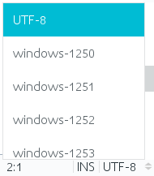

# NetBeans Encoding Plugin

This plugin opens/saves a file with a specified encoding.

## Requirements

- NetBeans8.2+

## Open/Save in Encoding

File > Open/Save in Encoding...

## Show encoding on the status line

Current file encoding will be shown on the status line. If you want to change encoding, Please click the encoding label.
(Note: Then, file is closed once and opened again. i.e. File is reopened.)

## Search encodings

To search encodings, you can type something when the encoding list is shown.
You can use <kbd>↑</kbd> and <kbd>↓</kbd>key to change the selected encoding.
You can use <kbd>Enter</kbd> key to decide the encoding.

## Hide the encoding list

Just type <kbd>ESC</kbd> key or click other than the encoding list.

## Downloads

- https://github.com/junichi11/netbeans-encoding-plugin/releases
- http://plugins.netbeans.org/plugin/60487/encoding-support

## Donation

- https://github.com/sponsors/junichi11

## Translations

- [README_es.md](README_es.md) - Español ([@javatlacati](https://github.com/javatlacati))

## License

[Common Development and Distribution License (CDDL) v1.0 and GNU General Public License (GPL) v2](http://netbeans.org/cddl-gplv2.html)

----
Cloned from `encoding module` of `main/contrib` repository. ([Tomas Zezula](https://github.com/tzezula))

Also see [https://netbeans.org/bugzilla/show_bug.cgi?id=114123](https://netbeans.org/bugzilla/show_bug.cgi?id=114123)
